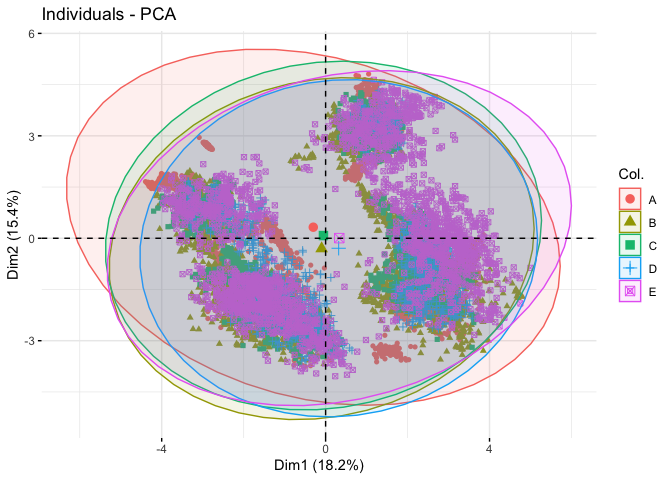

<!---- COMMENT  --->
# Executive Summary
The goal of your project is to predict the manner in which subjects did a simple arm curl exercise.
A Random Forest model was selected for modeling the behaviors.
Labeled data was provided with 5 categories. Model class error rates are in (xxxx):  
A: exactly according to the specification (0.0024),  
B: throwing the elbows to the front (0.0202),  
C: lifting the dumbbell only halfway (0.0170),  
D: lowering the dumbbell only halfway (0.0171) and  
E: throwing the hips to the front (0.0074)  

This writeup proceeds with a discussion of data structure and cleaning, model development and presentation of final model results.


# Data Structure and cleaning
A primary challenge with the data structure is that columns for skewness and kurtosis were not populated.  These columns were also N/A in the test set.  In some cases there was missing data.  Columns were removed that had N/A.
Another approuch used in this data analysis was to use replace the vector components with the magnatude of vectors using a simple function: 
mag = sqrt(var_x^2 + var_y^2 + var_z^2)


```
## [1] "Dimension of training set:   rows: 19622  variables 65"
```

```
## [1] "Dimension of test     set:   rows: 20  variables 65"
```

```
## [1] "Split the training set into a training and validation set"
```

```
## [1] "Dimension of subTrain set:   rows: 11776  variables 29"
```

```
## [1] "Labeled data for subTrain set"
```

```
## 
##    A    B    C    D    E 
## 3348 2279 2054 1930 2165
```

```
## [1] "Dimension of subTest set:   rows: 7846  variables 29"
```

```
## [1] "Labeled data for subTest set"
```

```
## 
##    A    B    C    D    E 
## 2232 1518 1368 1286 1442
```

# Model Development
This section examines features of the training dataset and develops a model for prediction.
Once the datasets were cleaned the training data set was divided into a sub-train and sub-test group.
Several models were fit to the data to examine features and model use of prediction

## Data Dimensionality - Principle components

A Principle Component analysis was performed. The first two dimensions are shown in the graphic.  Although there does appear to be structure in the data the structure do not seem to related to the exercise labels (A-E).

<!-- -->

## Modeling
The random forest model was run against the subTest sample (selected from the original training data).  Overall accuracy of 0.99  
OOB estimate of  error rate: 1.17%


```
## Confusion Matrix and Statistics
## 
##           Actual Response
## Prediction    A    B    C    D    E
##          A 2231    9    0    0    0
##          B    1 1499    9    0    0
##          C    0    9 1348    6    5
##          D    0    0   11 1278    5
##          E    0    1    0    2 1432
## 
## Overall Statistics
##                                           
##                Accuracy : 0.9926          
##                  95% CI : (0.9905, 0.9944)
##     No Information Rate : 0.2845          
##     P-Value [Acc > NIR] : < 2.2e-16       
##                                           
##                   Kappa : 0.9906          
##                                           
##  Mcnemar's Test P-Value : NA              
## 
## Statistics by Class:
## 
##                      Class: A Class: B Class: C Class: D Class: E
## Sensitivity            0.9996   0.9875   0.9854   0.9938   0.9931
## Specificity            0.9984   0.9984   0.9969   0.9976   0.9995
## Pos Pred Value         0.9960   0.9934   0.9854   0.9876   0.9979
## Neg Pred Value         0.9998   0.9970   0.9969   0.9988   0.9984
## Prevalence             0.2845   0.1935   0.1744   0.1639   0.1838
## Detection Rate         0.2843   0.1911   0.1718   0.1629   0.1825
## Detection Prevalence   0.2855   0.1923   0.1744   0.1649   0.1829
## Balanced Accuracy      0.9990   0.9930   0.9911   0.9957   0.9963
```

# Appendix - Code used

```r
# Set Environment 
knitr::opts_chunk$set(echo = TRUE)
#library(rmdfiltr)
library(doParallel)
library(caret)
library(randomForest)
#library(rattle)   # Print Random Forests
#library(corrplot) # Plotting variables that are correlated
library(FactoMineR)
library(factoextra) # PCA visualization
library(e1071)

# Calculate vector magnatude. 
mag <- function(x = double,y = double,z =double){ d = sqrt(x^2 + y^2 + z^2); d}

# Read file and convert "#DIV/0!" to NA - change outcome variable to factor
pml_train = read.csv("./pml-training.csv", stringsAsFactors=FALSE, na.strings = c("NA", "#DIV/0!")) # Read file
pml_test  = read.csv("./pml-testing.csv",  stringsAsFactors=FALSE, na.strings = c("NA", "#DIV/0!")) # Read file
pml_train$classe = as.factor(pml_train$classe)
pml_train$new_window = as.factor(pml_train$new_window)
# pml_test$classe =  as.factor(pml_test$classe) - Values not provided
pml_test$new_window = as.factor((pml_test$new_window))


# remove columns with missing data AND were not part selected as features.  Not mentioned as a festure in
# original paaper.

# Remove columns that are NA in training and test sets.
c = c() ; n=0;for (i in 1:160) { x = sum(is.na(pml_train[,i])); 
if(x>0) {n=n+1; c[length(c)+1] = i }}
# paste("col remove = ",n) 
# print("Column list:"); c

# drop columns not used or missing data
pml_train_clean = subset(pml_train, select=-c(1:7, c))
pml_test_clean  = subset(pml_test,  select=-c(1:7, c))


### for training data calculate magnitude of vectors
pml_train_clean$gyros_belt_mag = mag(pml_train_clean$gyros_belt_x, pml_train_clean$gyros_belt_y, pml_train_clean$gyros_belt_z)
pml_train_clean$accel_belt_mag = mag(pml_train_clean$accel_belt_x, pml_train_clean$accel_belt_y, pml_train_clean$accel_belt_z)
pml_train_clean$magnet_belt_mag = mag(pml_train_clean$magnet_belt_x, pml_train_clean$magnet_belt_y, pml_train_clean$magnet_belt_z)

pml_train_clean$gyros_arm_mag = mag(pml_train_clean$gyros_arm_x, pml_train_clean$gyros_arm_y, pml_train_clean$gyros_arm_z)
pml_train_clean$accel_arm_mag = mag(pml_train_clean$accel_arm_x, pml_train_clean$accel_arm_y, pml_train_clean$accel_arm_z)
pml_train_clean$magnet_arm_mag = mag(pml_train_clean$magnet_arm_x, pml_train_clean$magnet_arm_y, pml_train_clean$magnet_arm_z)

pml_train_clean$gyros_dumbbell_mag = mag(pml_train_clean$gyros_dumbbell_x, pml_train_clean$gyros_dumbbell_y, pml_train_clean$gyros_dumbbell_z)
pml_train_clean$accel_dumbbell_mag = mag(pml_train_clean$accel_dumbbell_x, pml_train_clean$accel_dumbbell_y, pml_train_clean$accel_dumbbell_z)
pml_train_clean$magnet_dumbbell_mag = mag(pml_train_clean$magnet_dumbbell_x, pml_train_clean$magnet_dumbbell_y, pml_train_clean$magnet_dumbbell_z)

pml_train_clean$gyros_forearm_mag = mag(pml_train_clean$gyros_forearm_x, pml_train_clean$gyros_forearm_y, pml_train_clean$gyros_forearm_z)
pml_train_clean$accel_forearm_mag = mag(pml_train_clean$accel_forearm_x, pml_train_clean$accel_forearm_y, pml_train_clean$accel_forearm_z)
pml_train_clean$magnet_forearm_mag = mag(pml_train_clean$magnet_forearm_x, pml_train_clean$magnet_forearm_y, pml_train_clean$magnet_forearm_z)

# replace vector direction w/magnitudes
pml_train_mag = pml_train_clean[c(1:4,14:17,27:30,40:43,54:65,53)]

### for training data calculate magnitude of vectors

pml_test_clean$gyros_belt_mag = mag(pml_test_clean$gyros_belt_x, pml_test_clean$gyros_belt_y, pml_test_clean$gyros_belt_z)
pml_test_clean$accel_belt_mag = mag(pml_test_clean$accel_belt_x, pml_test_clean$accel_belt_y, pml_test_clean$accel_belt_z)
pml_test_clean$magnet_belt_mag = mag(pml_test_clean$magnet_belt_x, pml_test_clean$magnet_belt_y, pml_test_clean$magnet_belt_z)

pml_test_clean$gyros_arm_mag = mag(pml_test_clean$gyros_arm_x, pml_test_clean$gyros_arm_y, pml_test_clean$gyros_arm_z)
pml_test_clean$accel_arm_mag = mag(pml_test_clean$accel_arm_x, pml_test_clean$accel_arm_y, pml_test_clean$accel_arm_z)
pml_test_clean$magnet_arm_mag = mag(pml_test_clean$magnet_arm_x, pml_test_clean$magnet_arm_y, pml_test_clean$magnet_arm_z)

pml_test_clean$gyros_dumbbell_mag = mag(pml_test_clean$gyros_dumbbell_x, pml_test_clean$gyros_dumbbell_y, pml_test_clean$gyros_dumbbell_z)
pml_test_clean$accel_dumbbell_mag = mag(pml_test_clean$accel_dumbbell_x, pml_test_clean$accel_dumbbell_y, pml_test_clean$accel_dumbbell_z)
pml_test_clean$magnet_dumbbell_mag = mag(pml_test_clean$magnet_dumbbell_x, pml_test_clean$magnet_dumbbell_y, pml_test_clean$magnet_dumbbell_z)

pml_test_clean$gyros_forearm_mag = mag(pml_test_clean$gyros_forearm_x, pml_test_clean$gyros_forearm_y, pml_test_clean$gyros_forearm_z)
pml_test_clean$accel_forearm_mag = mag(pml_test_clean$accel_forearm_x, pml_test_clean$accel_forearm_y, pml_test_clean$accel_forearm_z)
pml_test_clean$magnet_forearm_mag = mag(pml_test_clean$magnet_forearm_x, pml_test_clean$magnet_forearm_y, pml_test_clean$magnet_forearm_z)

# replace vector direction w/magnitudes
pml_test_mag = pml_test_clean[c(1:4,14:17,27:30,40:43,54:65,53)]

print(paste("Dimension of training set:  ","rows:",dim(pml_train_clean)[1], 
            " variables",dim(pml_train_clean)[2]))
print(paste("Dimension of test     set:  ","rows:",dim(pml_test_clean)[1], 
            " variables",dim(pml_test_clean)[2]))

# Since "test" set is for the quiz - split the training set into two groups train & subtest
set.seed(12345)
inTrain <- createDataPartition(y=pml_train_mag$classe, p=0.6, list = FALSE)
pml_subTrain = pml_train_mag[ inTrain, ]
pml_subTest  = pml_train_mag[-inTrain, ]

print("Split the training set into a training and validation set")
print(paste("Dimension of subTrain set:  ","rows:",dim(pml_subTrain)[1], 
            " variables",dim(pml_subTrain)[2]))
print("Labeled data for subTrain set")
table(pml_subTrain$classe)

print(paste("Dimension of subTest set:  ","rows:",dim(pml_subTest)[1], 
            " variables",dim(pml_subTest)[2]))
print("Labeled data for subTest set")
table(pml_subTest$classe)

# Principle component analysis of 'predictor' variables [,1:28]
prmod = PCA(pml_subTrain[,c(1:28)], graph = FALSE, ncp = 15, scale.unit = TRUE)

# Remove single extreme valuse and and rerun PCA
# pml_train[5373,] is pml_subTrain[3222,]
pml_subTrain1 = pml_subTrain[-c(3222),]
prmod2 = PCA(pml_subTrain1[,c(1:28)], graph = FALSE, ncp = 15, scale.unit = TRUE)
fviz_pca_ind(prmod2, axes = c(1,2), geom = c("point"), 
             col.ind = pml_subTrain1$classe, addEllipses = TRUE)

rfmod = train(classe ~., pml_subTrain1, preProcess = c("center", "scale"), method = "rf")
rfprd = predict(rfmod, pml_subTest)
confusionMatrix(rfprd, pml_subTest$classe, dnn = c("Prediction", "Actual Response"))


# End collective code
```
